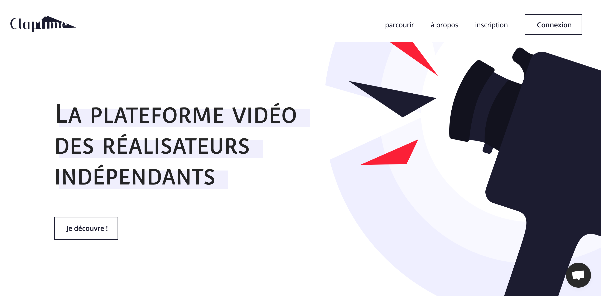
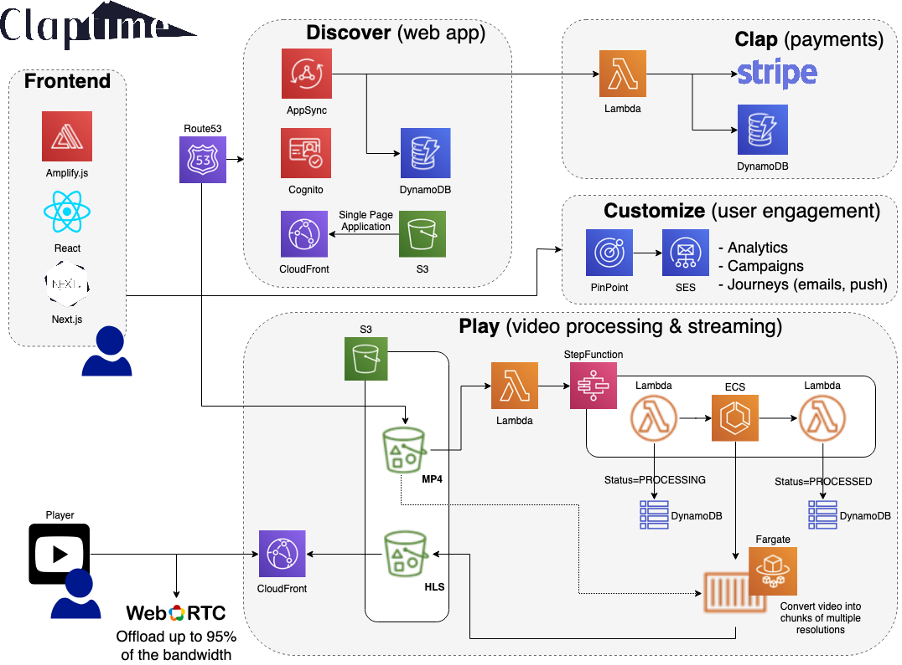

# 🎬 Claptime

## 👀 About

🎯 **[Claptime](https://www.clap-time.com/)** is a video on demand platform dedicated to indie movies. Your can find more information about the project in [our manifest](https://www.clap-time.com/about/project/manifest/). It is now part of the [LabFilms ecosystem](https://info.labfilms.org/).

🎁 This repository hosts the code of the whole platform available at [www.clap-time.com](https://www.clap-time.com). Use it well, my friend.

🇫🇷 At this time, the platform is only available in French, and distributes French-speaking movies. While the source code and the documentation are in English, you might come across some external resources in French.

🏴‍☠️ The source code of Claptime is distributed under the terms of [The Unlicense](./LICENSE.md). Please note that this does not apply to the Claptime trademark nor the graphic assets.

💬 Any help would be much appreciated. If you like the project and want to give a hand, drop us an email at [contact.claptime@gmail.com](mailto:contact.claptime@gmail.com). There are many ways to contribute: development, design, communication, film curation, testing, and of course feedback. If you're familiar with GitHub, feel free to open [issues](issues/) and [pull requests](pulls/) as well.

## 🏛 Overview

Claptime is a cloud application hosted on AWS and leverages as much as possible serverless and managed services. The following diagram describes its high-level architecture:

Claptime is built with the [AWS Amplify framework](https://aws.amazon.com/amplify/), which makes the glue between our frontend and our backend. You wll find the Amplify application in `web/`.

It also uses the [Serverless framework](https://www.serverless.com/open-source/) to create some custom [services](./services/). Shared libraries are defined in the [commons package](./commons).

A [`claptime` CLI](./cli/) is available and provides useful commands to developers for deployments, migrations and local development. Some [fixtures](./fixtures) are available to fill your developer environment with real data.

It uses GitHub Actions to run some code checks (see [workflows](./.github/workflows)), and Amplify Hosting to deploy and host the app (see the [cd.yml](./cd.yml) CloudFormation stack and the [amplify.yml](./amplify.yml) CD configuration).

## 📚 Documentation

### [🧑‍💻 Developer setup](./docs/Setup.md)

### [💾 Data storage](./docs/Storage.md)

### [🤓 Understanding the VideoNode concept](./docs/VideoNode.md)

### [💸 Donations workflow](./docs/Donations.md)

Note: Some diagrams and charts are written using [Mermaid](https://mermaid-js.github.io/mermaid). When editing their definition, they can be previewed in Visual Studio Code using the [Markdown Preview Mermaid Support](https://marketplace.visualstudio.com/items?itemName=bierner.markdown-mermaid) extension.
