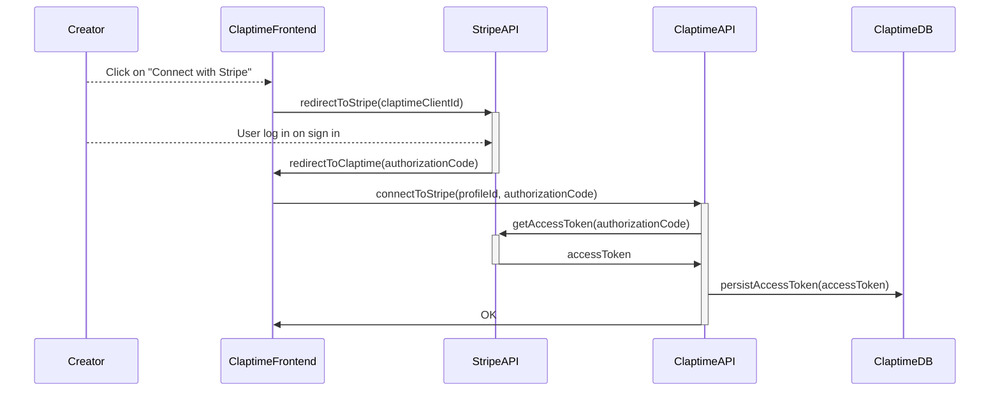
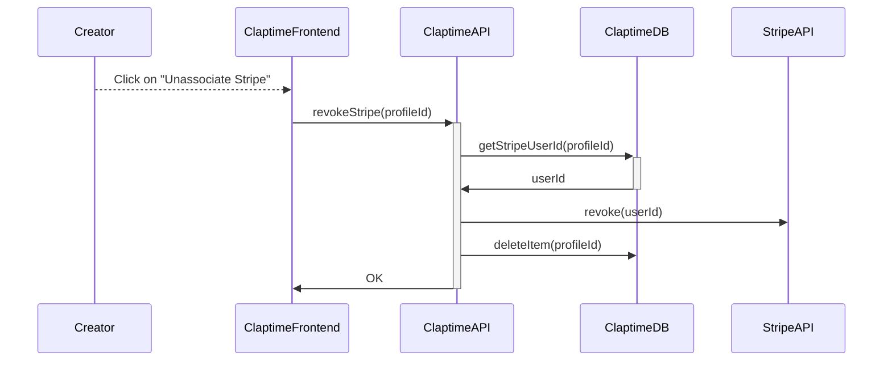
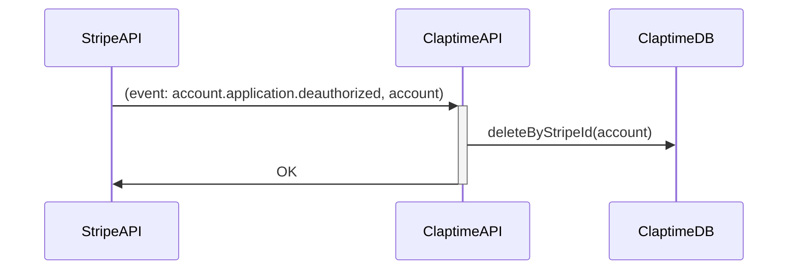

# 💸 Donations

## Stripe for creators

We are following [this process](https://stripe.com/docs/connect/standard-accounts).

### Connect

### Revoke

### Webhooks

Stripe can be configured to query our endpoint in case of some events (see [webhooks](https://stripe.com/docs/connect/webhooks)).
We configured it to be alerted in case of `account.application.deauthorized`.

