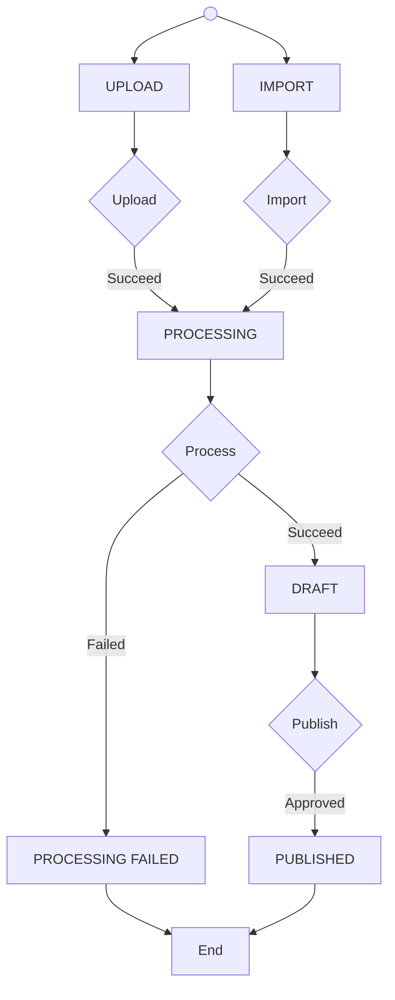

# Video status

The following flow chart can be previewd in Visual Studio Code using the [Markdown Preview Mermaid Support](https://marketplace.visualstudio.com/items?itemName=bierner.markdown-mermaid) extension.

At any time, the user can also delete the video which immediately deletes it from our database.

## Available actions depending on status

|                   | Save | Publish | Unpublish | Delete | View | Upload |
| ----------------: | :--: | :-----: | :-------: | :----: | :--: | :----: |
|            IMPORT |  ✓   |         |           |   ✓    |      |        |
|            UPLOAD |  ✓   |         |           |   ✓    |      |   ✓    |
|        PROCESSING |  ✓   |         |           |   ✓    |      |        |
| PROCESSING_FAILED |  ✓   |         |           |   ✓    |      |   ✓    |
|             DRAFT |  ✓   |    ✓    |           |   ✓    |  ✓   |        |
|         PUBLISHED |  ✓   |         |     ✓     |        |  ✓   |        |

## Required fields to do actions

|         | Title | Description | Category | Release year | Cover | Credits |
| ------- | :---: | :---------: | :------: | :----------: | :---: | :-----: |
| Save    |   ✓   |             |          |              |       |         |
| Publish |   ✓   |      ✓      |    ✓     |      ✓       |   ✓   |         |
