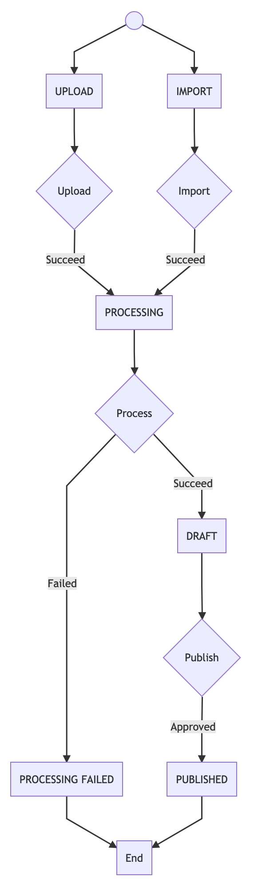
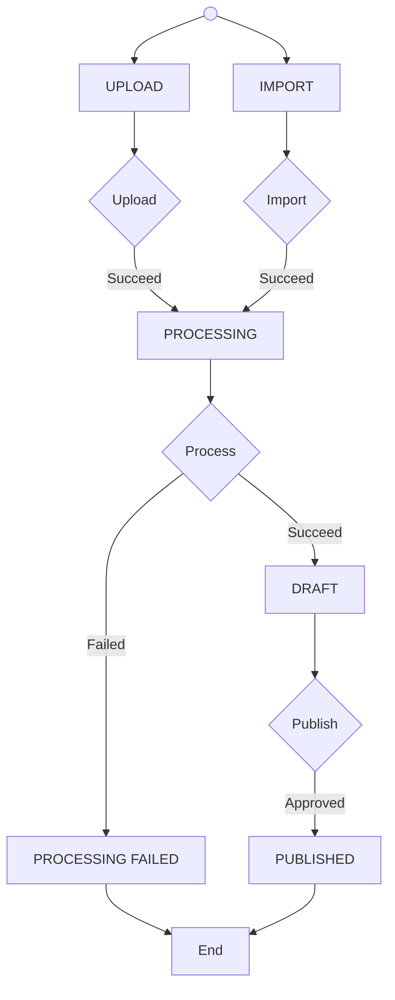

# 🤓 Understanding the VideoNode concept

A **VideoNode**, in Claptime jargon, is an abstract type that embraces films, series and series episodes.
We can see this as a tree structure: a video is a leaf, and can either be a film or a series episode depending if it has a parent node or not. This might sounds complicated at first, but also makes it easier because both concepts are stored and can be queried in the same way.

## Lifecycle

  
Diagram definition

At any time, the user can also delete the video node which immediately deletes it from our database.

## Available actions depending on status

|                   | Save | Publish | Unpublish | Delete | View | Upload |
| ----------------: | :--: | :-----: | :-------: | :----: | :--: | :----: |
|            IMPORT |  ✓   |         |           |   ✓    |      |        |
|            UPLOAD |  ✓   |         |           |   ✓    |      |   ✓    |
|        PROCESSING |  ✓   |         |           |   ✓    |      |        |
| PROCESSING_FAILED |  ✓   |         |           |   ✓    |      |   ✓    |
|             DRAFT |  ✓   |    ✓    |           |   ✓    |  ✓   |        |
|         PUBLISHED |  ✓   |         |     ✓     |        |  ✓   |        |
